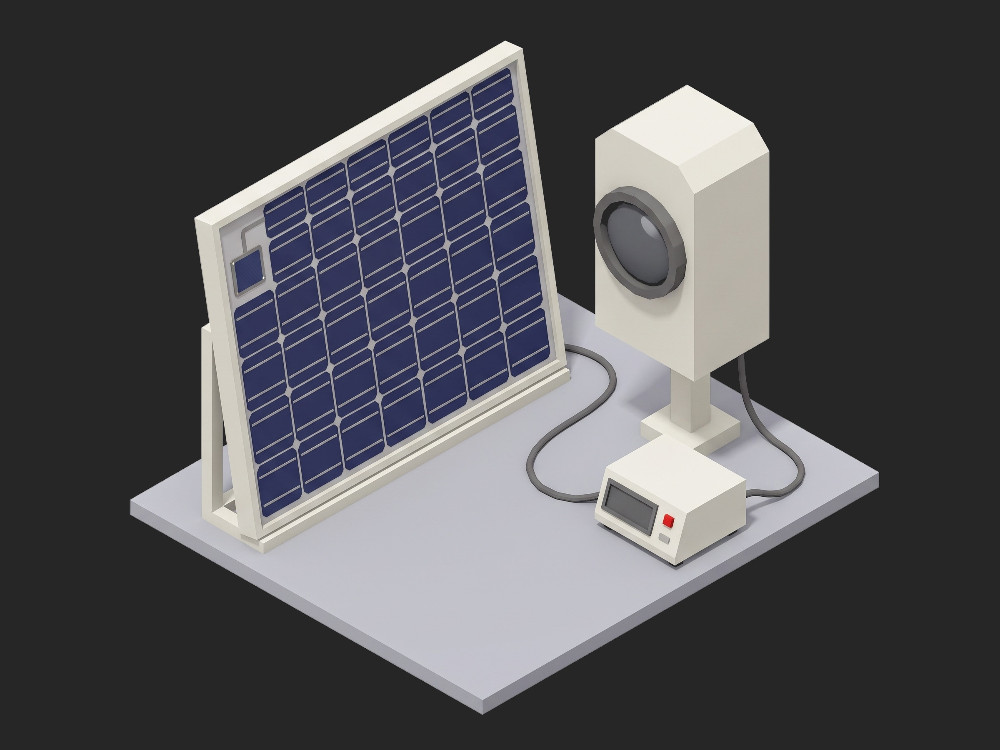

# Framework Solar Array Flash Test



A TofuPilot Framework procedure for the electrical acceptance of a smallsat solar panel under a large-area pulsed solar simulator: three reference-cell pulses in setup for the lamp's intensity and pulse-to-pulse repeatability, the ECSS-E-ST-20-08 health check (insulation resistance at 500 V on three paths, panel capacitance), one flash per string with the load sweeping the IV curve during the pulse and every curve corrected to 25 °C and 1 solar constant AM0 from the reference cell's reading of the same pulse and the panel thermocouple, Pmax and fill factor per string with the string match, and the forward drop of all 24 bypass diodes. The mock bench synthesizes a healthy four-string panel at 23 °C with one string 1.5 % low and a flasher at 0.4 % pulse-to-pulse.

## What This Shows

| Feature | Where |
|---------|-------|
| Four curves in one measurement, each with its own aggregations and limits | `iv` -- `string_1` to `string_4` (`pmax_w`, `isc_a`, `voc_v`, `fill_factor`) |
| A physics correction coded in `utils/`, shared by phases and charts | `utils/correction.py` -- `correct_to_stc`, `iv_metrics` |
| Reference instrument validated in setup on three pulses | `reference_check` -- `pulse_repeat_pct`, `lamp_intensity_sc` |
| Consumable tracked on the unit and the run | `release` -- `pulses_this_run`, `unit.metadata["flash_pulses"]` |
| Scalar limits from a standard's example values | `health_check` -- IR ≥ 100 MΩ at 500 V |
| Setup gate, teardown that shorts the panel, `depends_on` chain, timeout | `procedure.yaml` |

## Get Started

1. Sign up for a free TofuPilot account at [tofupilot.app](https://www.tofupilot.app/auth/signup).
2. Open the **New Procedure** flow in the dashboard and clone this template.
3. Follow the dashboard's instructions to set up a station and run the procedure.

For deeper guides, see the [TofuPilot docs](https://www.tofupilot.com/docs/framework) and the [Solar Array Flash Test template page](https://www.tofupilot.com/templates/solar-array-flash-test).

## Structure

```
.
├── procedure.yaml                    # Procedure, plug, phases, measurements
├── phases/
│   ├── reference_check.py            # Setup: three reference pulses, lamp intensity, temperature
│   ├── health_check.py               # IR at 500 V on three paths, capacitance
│   ├── flash_iv.py                   # One flash per string, corrected IV, Pmax, FF, match
│   ├── bypass_diodes.py              # Vf of every bypass diode at string current
│   └── release.py                    # Teardown: panel shorted, pulse count logged
├── plugs/
│   └── flash_bench.py                # Mock flasher + reference cell + load + megger + LCR
├── utils/
│   ├── recipe.py                     # Panel layout, cell data, coefficients, limits
│   └── correction.py                 # Correction to 25 °C / 1 SC AM0, IV metrics
├── pyproject.toml                    # uv-managed Python project
└── README.md
```

## Replace the Mock with Real Hardware

`plugs/flash_bench.py` maps to a Spectrolab LAPSS II or an Angstrom Designs flasher through its control software, a fast IV load triggered on the pulse, a Keysight B2985 electrometer or a megohmmeter for the 500 V insulation test, an LCR meter and the panel thermocouples through a DAQ. Keep the reference cell in the test plane on every pulse, use its calibrated value from the secondary standard's certificate, and record the lamp pulse count against the tube's rated life. The phases, measurements and limits stay the same.
